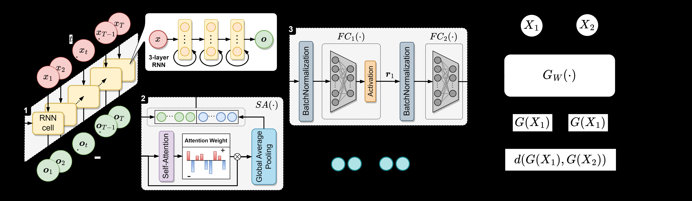
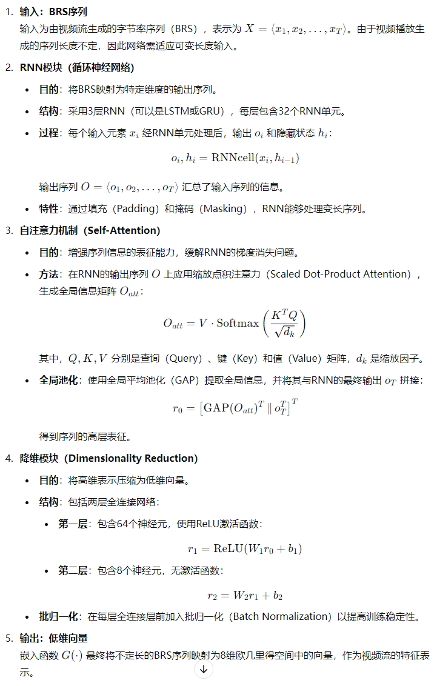
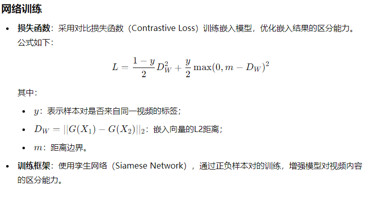

# **EVS2vec A Low-dimensional Embedding Method for Encrypted Video Stream Analysis**
1. ### 时间2023
2. ### 国防科技大学计算机学院
3. ### CCF-B
4. ### [作者代码地址](https://github.com/Shangshu-LAB/EVS2vec.git)
5. ### 数据集（待查证，a public dataset developed by Dubin et al. that was previously utilized in [3]）
5. ### 引入网络波动因素
# **方法**
1. ### 基于字节率序列（Byte Rate Sequence, BRS）的低维嵌入方法
2. ### 基于循环神经网络（RNN）和自注意力机制的网络结构，并通过孪生网络（Siamese Network）进行训练，以确保嵌入结果的内容相关性区分能力。
# **贡献**
1. ### 将嵌入式技术应用到加密视频流量分析，降低计算复杂度
2. ### 所提方法对下游任务有效
# **原有方法局限性**
1. ### 标签有限，实际环境无限，不适用真实环境
2. ### 5元组计算成本高
# **挑战性**
1. ### 嵌入方法需要提供内容相关差异化表示
2. ### 表示结果应当是从不定长BRS中提取特征向量
# **存在问题**
1. ### 对语义信息的分析能力有限
2. ### 训练数据仅涵盖单一网站
# **网络结构**

### 

 

