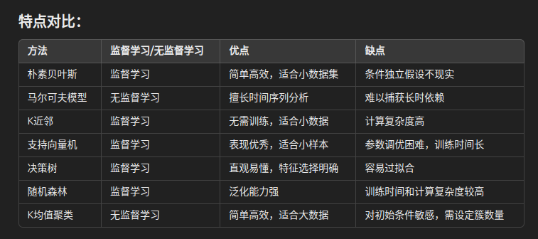
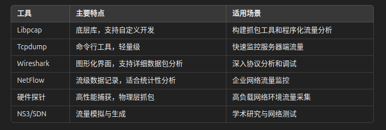
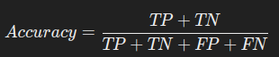
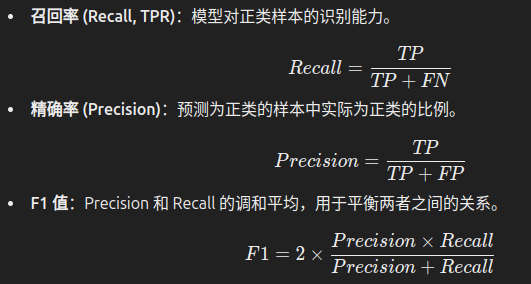
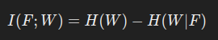
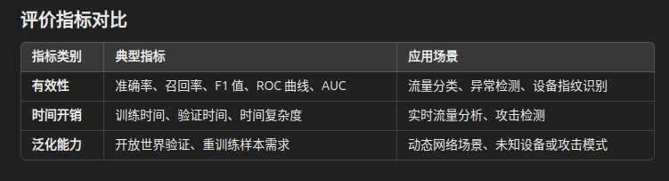

# **EVS2vec A Low-dimensional Embedding Method for Encrypted Video Stream Analysis**
1. ### 时间2023
2. ### 国防科技大学计算机学院
3. ### CCF-B
4. ### [作者代码地址](https://github.com/Shangshu-LAB/EVS2vec.git)
5. ### 数据集（待查证，a public dataset developed by Dubin et al. that was previously utilized in [3]）
5. ### 引入网络波动因素
# **典型传统方法**
1. ### 朴素贝叶斯 (Naïve Bayes)
特点：基于贝叶斯定理和条件独立假设进行分类。
优势：简单高效，适用于小数据集。
缺点：依赖特征独立性假设，实际应用中可能不完全成立。
2. ### 马尔可夫模型 (Markov Model)
特点：利用状态之间的转移概率进行建模，适合分析时间序列数据。
应用：适合处理网络流量中的序列模式。
限制：通常只关注最近的状态（如一阶马尔可夫链），无法捕获长时依赖关系。
3. ### K近邻 (k-Nearest Neighbor, k-NN)
特点：根据样本之间的距离（如欧几里得距离、曼哈顿距离）进行分类。
优点：无需训练过程，适合小规模数据。
缺点：计算复杂度较高，对大规模数据不适用。
4. ### 支持向量机 (Support Vector Machine, SVM)
特点：通过核函数将低维特征映射到高维空间，从而实现线性不可分问题的分类。
优点：对小样本和高维特征表现良好。
缺点：对参数调优敏感，训练时间较长。
5. ### 决策树 (Decision Tree, DT)
特点：基于树形结构进行决策，节点代表特征条件，叶节点表示分类结果。
优点：直观易懂，特征选择明确。
缺点：容易过拟合，泛化能力有限。
6. ### 随机森林 (Random Forest, RF)
特点：由多个决策树组成，通过投票机制提高分类性能。
优点：相比单一决策树，更强的泛化能力。
缺点：计算开销较大，难以解释模型内部机制。
7. ### K均值聚类 (k-Means)
特点：基于样本与簇中心的距离进行无监督学习，将样本分为k个聚类。
优点：简单高效，适合处理大规模数据。
缺点：需要预先设定簇的数量k，对初始簇中心敏感。

# **深度学习方法**

1. ### 卷积神经网络 (Convolutional Neural Network, CNN)
特点：
CNN通过卷积操作提取局部特征，具有良好的泛化能力。
特别适合处理流量数据中的空间特征，例如将数据流转化为二维特征图像进行分析。
应用：
例如，利用数据包方向或时间间隔的序列，将其转化为“图像”输入到CNN进行分类。
优势：
自动提取特征，避免手工特征工程。
能处理大规模数据，并在加密流量分类中表现优异。
案例：
某些研究通过将数据流量转化为矩阵或图像输入CNN，从而解决多设备分类问题。
2. ### 图神经网络 (Graph Neural Network, GNN)
特点：
适用于处理图结构数据（如流量中的节点和连接关系），能够学习流量模式中的复杂依赖关系。
包括图卷积网络 (GCN) 和图注意力网络 (GAT) 等变体。
应用：
构建基于网络连接关系的图模型，例如将流量的不同数据包建模为图的节点，节点间的关系为图的边。
优势：
在网络流量中提取数据包之间的隐藏关系，适合多种加密协议的特征提取。
案例：
某些研究利用GNN分析加密流量中设备的交互模式，从而实现设备或协议分类。
3. ### 长短期记忆网络 (Long Short-Term Memory, LSTM)
特点：
一种特殊的循环神经网络 (RNN)，能够捕获时间序列中的长时间依赖关系。
通过“记忆门”机制解决传统RNN在处理长序列时的梯度消失问题。
应用：
用于分析流量数据的时间依赖特性，例如数据包的时间间隔或顺序。
优势：
对于序列类型的数据，LSTM在时间模式识别和分类上表现出色。
案例：
通过学习数据包的时间序列关系来区分正常流量与异常流量。
4. ### 自动编码器 (Autoencoder)
特点：
无监督学习模型，用于数据降维和特征提取，通过重构输入数据最小化重构误差。
应用：
在加密流量分析中用于无监督异常检测。
优势：
能有效提取隐含特征，用于流量聚类或异常检测。
案例：
某些研究利用自动编码器检测网络中的异常流量行为。
5. ### 生成对抗网络 (Generative Adversarial Network, GAN)
特点：
包括生成器和判别器两个对抗模型，生成器生成逼真的伪造数据，判别器区分真假。
应用：
在流量分析中用于生成模拟流量数据以扩展数据集，或用于伪装流量以测试分类器的鲁棒性。
优势：
能生成接近真实的流量模式，为流量分类提供更多训练数据。
案例：
使用GAN生成模拟的恶意流量，用于测试分类模型的性能。
6. ### 混合模型
特点：
结合多种深度学习模型（如CNN + LSTM）以提高分类或检测性能。
应用：
例如利用CNN提取空间特征，再结合LSTM捕获时间序列依赖，实现更高效的加密流量分类。
优势：
融合多种模型的优点，适应复杂场景。
案例：
用于加密流量中的恶意行为检测和协议分类。

# **流量加密机制**

1. ### IPSec（网络层）
特点：
在网络层提供安全通信，确保数据包的完整性和保密性。
包括安全关联（SA）、认证头（AH）和封装安全载荷（ESP）。
工作原理：
通过认证通信双方、加密数据以及防篡改功能来保证传输安全。
应用场景：
VPN（虚拟专用网络）中常用的加密机制，用于构建安全的隧道通信。
2.  ### SSL/TLS（传输层与应用层之间）
特点：
确保传输层上的数据安全，防止攻击者获取或篡改信息。
TLS 是 SSL 的继任者，目前广泛使用的是 TLS 1.3。
工作原理：
包括握手协议（加密算法协商、密钥交换、身份认证）、警报协议（异常通知）和记录协议（数据分片与加密）。
应用场景：
HTTPS 中最核心的加密组件，用于保护网页浏览、支付和电子邮件等通信。
3.  ### SSH（应用层）
特点：
为客户端与远程主机之间的通信提供安全性，防止信息泄露。
通过公钥加密和对称密钥加密保证密钥的安全性。
工作原理：
包括传输层协议（SSH-TRANS）、用户认证协议（SSH-USERAUTH）和连接协议（SSH-CONNECT）。
应用场景：
远程登录和文件传输（如 SFTP）。
4. ### HTTPS（应用层）
特点：
在 HTTP 上添加 SSL/TLS，提供加密传输、身份认证和数据完整性保护。
相较于 HTTP，HTTPS 是更安全的通信协议。
工作原理：
通过加密保护请求和响应内容，防止敏感信息泄露。
应用场景：
用于电商、银行和其他涉及敏感数据的在线服务。
5.  ### QUIC（基于 UDP 的快速传输层协议）
特点：
新一代低延迟传输协议，与传统的基于 TCP 的 TLS 不同，QUIC 基于 UDP。
支持多路复用，避免“队头阻塞”（head-of-line blocking）。
工作原理：
在握手时完成加密密钥协商和连接建立，减少连接延迟。
应用场景：
Google 的许多服务（如 YouTube）使用 QUIC 协议提高网络传输效率。
6.  ### Tor（洋葱路由，匿名通信）
特点：
提供低延迟和匿名访问服务，通过多层加密实现通信保护。
每一层路由节点只能看到前后一个节点的信息，无法知道数据来源和目的地。
工作原理：
客户端与三个中继节点建立加密会话，每次访问随机选择新路由，并加密通信数据。
应用场景：
用于规避审查和保护隐私，但也可能被滥用于非法活动。
7.  ### 嵌套加密（Nested Encryption）
特点：
通过两层独立加密隧道（如 IPSec 或 MACsec）提高数据传输的安全性。
工作原理：
数据经过双重加密后在“黑网络”中传输，目标端再依次解密。
应用场景：
国家安全通信中的跨安全级别网络连接。

# **常见抓包工具**

1. ###  Libpcap
简介：
一个广泛使用的开源网络数据包捕获库，基于 C/C++ 实现。
位于数据链路层，能够捕获 TCP/IP 及其他协议的数据包。
特点：
定义了标准的数据包存储格式（pcap文件）。
是许多流量抓取工具（如 Tcpdump 和 Wireshark）的底层基础。
应用场景：
提供程序化接口，用于构建自定义流量抓取和分析工具。
2. ###  Tcpdump
简介：
基于 Libpcap 的命令行流量分析工具，运行于 Linux 系统。
可捕获和记录网络数据包，并将其保存为 pcap 格式文件。
特点：
支持基于正则表达式的流量过滤。
参数灵活，可自定义抓包数量、包大小、协议等。
优势：
轻量级，适合服务器端的快速流量监控。
限制：
无图形界面，需熟悉命令行操作。
3.  ### Wireshark
简介：
基于图形界面的流量抓取工具，被称为 Tcpdump 的“可视化版本”。
支持多平台（如 Windows、Linux 和 macOS）。
特点：
提供强大的协议分析功能，可视化显示数据包信息（如不同协议用不同颜色区分）。
支持实时流量捕获和离线分析。
优势：
用户体验友好，适合深入分析数据包内容。
限制：
相较于 Tcpdump，消耗更多内存和 CPU。
4.  ### NetFlow
简介：
由 Cisco 提出的网络监控技术，专注于流级别数据的采集和分析。
特点：
提供流量的统计信息，而非逐包记录（即流级视图）。
定义了网络流的“五元组”（源 IP、目的 IP、源端口、目的端口、协议）。
应用场景：
企业网络的流量监控、分析和优化。
更适合处理大规模网络中的流量数据。
5.  ### 硬件探针（Hardware Probe）
简介：
一种基于硬件的流量捕获和分析工具。
特点：
在物理层捕获数据包，能够提供更及时和精确的信息。
不消耗网络资源，但价格昂贵且灵活性较低。
应用场景：
高性能网络环境下的流量监控。
6.  ### 模拟网络流量工具
NS3：
一种网络仿真工具，用于模拟网络环境中的流量传输。
适用于测试和研究网络协议与流量特性。
SDN（软件定义网络）：
通过其灵活的网络架构，支持网络流量的监控与采集。

# **加密流量分析中的典型评价指标**
1. ### 有效性指标
有效性指标主要用于衡量模型的分类准确性和错误率，尤其是在加密流量分析中的分类或检测任务中。

（1）基本分类指标
准确率 (Accuracy)：正确分类样本占总样本数的比例。
 
错误率 (Error Rate)：错误分类样本占总样本数的比例。
（2）混淆矩阵相关指标
混淆矩阵包括以下四个元素：
TP（真阳性）：正类样本被正确分类为正类的数量。
TN（真阴性）：负类样本被正确分类为负类的数量。
FP（假阳性）：负类样本被误分类为正类的数量。
FN（假阴性）：正类样本被误分类为负类的数量。
基于此，定义以下指标：

 （3）曲线与面积指标
ROC 曲线：以 TPR 为纵轴，FPR（假阳性率，FP/实际负样本数）为横轴，评估模型整体性能。
AUC（ROC 曲线下的面积）：衡量模型区分正负样本的能力，AUC 值越接近 1，模型性能越好。
P-R 曲线：以 Precision 为纵轴，Recall 为横轴，常用于样本类别分布不平衡的场景。
（4）特定任务的自定义指标
互信息量 (Mutual Information)：用于网站指纹分析 (WF) 等场景，衡量某一特征与目标变量之间的相关性。

H(W)：目标变量 𝑊W 的熵。𝐻(𝑊∣𝐹)H(W∣F)：给定特征 
𝐹
F 后目标变量的条件熵。
2. ### 时间开销指标
时间开销指标用于衡量模型的运行效率，特别是在需要实时分析的场景中。

（1）训练时间
定义：模型在给定训练集上的训练所需时间。
应用：用于评估模型在大规模数据集上的训练效率。
（2）验证时间
定义：模型在测试集上完成推理（分类或检测）的时间。
应用：用于实时流量分析任务，验证模型的响应速度。
（3）时间复杂度
定义：模型在理论上的计算复杂度（如 𝑂(𝑛)O(n)、𝑂(𝑛2)O(n2 )）。
应用：为不同规模数据输入提供性能预估。
3. ###  泛化能力指标
泛化能力指标衡量模型在训练数据之外的新数据集上的性能。
（1）开放世界验证（Open-world Validation）
定义：模型需要处理测试集中包含未知类别样本的情况。
场景：
新设备类型（设备指纹识别）。
新的网络攻击模式（异常检测）。
对比：
闭合世界验证（Closed-world Validation）：测试集中的样本类别完全在训练集中出现。
（2）重训练样本需求
定义：在训练数据分布变化或结构变化时，为适应新数据而需要重新训练模型所需的样本数量。
应用：用于评估模型的可迁移性和自适应能力。

# **网络资产识别方法**
1. ### 设备指纹识别方法
##### 传统机器学习方法：
###### 特征提取： 从数据包头部提取协议层信息（如IP头的TTL、TCP头的窗口大小）以及统计特征（如数据包大小均值、间隔时间）。
###### 模型使用： 常用支持向量机（SVM）、随机森林（RF）和决策树（DT）等分类算法。
###### 问题：依赖人工特征选择。无法实时识别，需等待流量完整传输后提取特征。
##### 深度学习方法：
###### 优点：
###### 使用深度学习模型（如卷积神经网络CNN或图神经网络GNN）从原始流量中自动提取特征。
###### 可实现端到端分类。
###### 挑战：对于新增设备类型，需重新训练模型。数据集有限，难以覆盖真实世界的设备多样性。
2. ### 操作系统识别方法
##### 传统机器学习方法：
###### 方法： 提取TCP/IP和TLS头部特征，并结合统计特征，如数据包吞吐量均值和最大值。
###### 使用案例： p0f工具通过TCP/IP头特征进行被动指纹识别，扩展后结合C4.5算法可识别旧版本操作系统。
###### 问题： 新系统的微小更新可能导致模型失效。
##### 知识库方法：
###### 方法： 利用预定义规则和特征库，通过相似性匹配实现识别。
###### 限制： 需要维护更新规则库，当多个系统类型特征相似时效果较差。

# **网络特性方向**
1. ### 用户体验质量（QoE）指标测量
###### 用户体验质量（QoE，Quality of Experience）测量旨在通过流量特征预测用户的服务质量感知，如视频分辨率、比特率、卡顿次数等。*** #### 
关键内容包括：

#### 特征提取与分析方法：
##### 传统机器学习：

###### 使用统计特征（如数据包大小、到达时间间隔）构建预测模型。
###### 利用随机森林（RF）等算法对QoE指标进行预测。
###### 示例：
###### Dimopoulos等人提取了数据包大小百分位数、时间间隔等10个特征，用于预测卡顿事件、分辨率和比特率。
###### Orsolic等人收集了不同带宽条件下YouTube流量，使用多种机器学习模型预测卡顿数量。
##### 深度学习：

###### 采用自动特征提取方法，将流量表示转化为序列或图结构，用于训练深度神经网络（如LSTM或CNN）。
挑战与局限：
###### 需要大量真实环境的数据，涵盖多种网络场景。
###### 实时测量的精度和效率需要提升。
2. ### 协议识别（Protocol Recognition）
###### 协议识别旨在从加密流量中解析服务所使用的协议，以了解网络中传输的内容类型。关键内容包括：
##### 传统机器学习：

###### 通过数据包头特征和统计特征（如流量模式、传输方向）实现分类。
###### 示例：Rimmer等人利用流量方向序列特征，结合KNN和SVM实现协议分类。
##### 深度学习：
###### 使用深度学习模型直接从流量序列或原始特征中提取高阶语义。
###### 示例：利用LSTM对基于流量模式的时序关系进行建模，以更精确地分类加密协议。
##### 挑战与局限：
###### 随着协议不断发展和加密方式日益复杂，分类模型需频繁更新。
###### 部分私有协议设计为隐藏其标识，增加了识别难度。

# **隐私泄露检测**

1. ### 目标与应用场景
隐私泄露检测旨在从加密流量中推测可能暴露的信息，例如用户访问的网站、使用的应用程序，以及在应用内的具体行为。尽管加密协议隐藏了数据包的有效负载，但加密流量的统计特征仍可能暴露用户活动。主要应用场景包括：

网站指纹识别（Website Fingerprinting，WF）： 推断用户访问的具体网站。
应用指纹识别（Application Fingerprinting，AF）： 确定用户使用的应用程序。
用户行为识别（User Action Identification）： 推测用户在应用中的具体操作（如邮件发送、视频观看）。
2. ### 方法与技术
1）特征提取
数据包级别特征： 如包大小、到达时间间隔、方向等。
统计特征： 基于多个数据包的统计属性，如平均大小、峰值、间隔时间分布。
时序特征： 利用加密流量的序列模式，反映用户行为的时间关联性。
2）分类与建模
传统机器学习：
使用支持向量机（SVM）、随机森林（RF）等模型进行分类。
示例：Panchenko等人使用SVM结合统计特征实现网站指纹识别。
深度学习：
利用卷积神经网络（CNN）、长短期记忆网络（LSTM）等模型，从原始流量中提取高阶特征。
示例：Rimmer等人利用CNN对数据包方向序列进行建模，实现加密流量中的高精度网站识别。
3. ### 挑战与局限
1）特征模糊性：
加密流量的特征变化大，可能导致识别模型的泛化能力不足。
不同用户行为的特征可能在某些场景下重叠。
2）抗干扰能力：
随着防御技术的发展（如流量混淆、填充技术），流量特征被掩盖，检测难度加大。
3）实时性需求：
应对用户行为检测和动态隐私泄露场景，要求模型在准确性和实时性之间取得平衡。

# **攻击检测**
1. ### 目标与应用场景
攻击检测旨在识别通过加密流量进行的恶意活动，例如：

恶意软件检测： 识别感染PC、手机和物联网设备的恶意软件（如WannaCry、Petya）。
网络异常检测： 包括分布式拒绝服务（DDoS）攻击、网络流量激增、异常流量模式等。
2. ### 方法与技术
1）特征提取
由于加密流量隐藏了数据包的有效载荷，传统基于内容的分析方法（如深度包检测）不再适用，研究主要聚焦于加密流量的统计特征和行为特征：

统计特征： 包括数据包大小分布、间隔时间、流量方向、流量突发特性等。
时间序列特征： 利用流量随时间变化的模式进行分析。
流级或会话级特征： 聚合分析流量中的数据包，提取如流量持续时间、峰值速率、流量突发频率等特征。

2）分类与建模

传统机器学习：

使用支持向量机（SVM）、随机森林（RF）、K近邻（k-NN）等分类算法。
示例：利用随机森林分析流量突发性与行为模式，区分正常流量与攻击流量。

深度学习：

卷积神经网络（CNN）：用于从流量特征图中提取模式。

长短期记忆网络（LSTM）：捕捉流量随时间的变化特征，检测持续性异常行为。
示例：GNN（图神经网络）结合流量的图表示形式，挖掘复杂的攻击模式。
3. ### 攻击类型与检测技术
1）DDoS攻击检测：
通过流量突发性和高流量速率检测。
示例：利用CNN从数据包大小序列中检测DDoS流量的异常特征。
2）恶意软件流量检测：
使用加密流量中隐藏的行为模式检测恶意软件生成的流量。
示例：结合流量序列的时间特性，通过LSTM模型预测异常流量。
3）零日攻击（Zero-Day Attacks）：
使用无监督学习方法（如聚类分析）检测未知攻击模式。
示例：通过密度聚类方法发现未标注的异常流量。
4. ### 挑战与局限
1）流量加密与混淆技术：
攻击者利用流量加密和混淆技术隐藏恶意活动，增加检测难度。

2）实时性要求：
许多攻击（如DDoS）需要在短时间内检测并采取措施，实时性至关重要。

3）数据多样性不足：
现有数据集通常局限于实验室环境，难以全面覆盖真实网络场景。

4）开放世界场景：
面对未见过的攻击模式，模型的泛化能力需要进一步提升。

5. ### 总结与未来方向
混合检测方法： 将传统机器学习与深度学习结合，充分利用统计和时序特征。
更强的泛化能力： 提升模型在未知攻击和动态网络环境中的适应性。
数据集构建： 需要大规模、多样化、真实环境下的公开数据集。

# **挑战和方向**
1. ### 面临的主要挑战
1）数据相关挑战

数据多样性不足：
当前研究大多依赖实验室环境中的模拟数据，缺乏真实网络流量数据集。
公开数据集难以覆盖复杂的实际场景，导致模型泛化能力受限。
隐私与安全问题：
由于涉及用户隐私，采集真实加密流量数据会面临法律和伦理方面的限制。
2）特征提取与流量表示
特征选择依赖性：
传统机器学习方法需要手动设计特征，且特征对特定场景的适应性较差。
流量多样性与复杂性：
流量的高维度特性和动态变化导致特征提取困难。
3）模型设计与性能
实时性与效率：
流量分析需要快速响应，但深度学习模型的复杂性可能增加计算成本。
未知场景适应：
模型需要在开放世界场景中有效识别未见过的流量模式。
鲁棒性不足：
面对混淆技术（如流量填充和加密协议伪装），现有模型的检测精度和可靠性降低。
4）应用部署与系统集成
跨平台适应性：
不同网络环境、设备和协议的差异对统一的流量分析系统提出了挑战。
资源约束：
部署在边缘设备上的模型需在有限计算资源下实现高效分析。
2. ### 未来研究方向
1）数据集与基准测试
构建大规模公开数据集：
需要覆盖多种网络环境、设备类型和流量模式的真实数据集，以支持多样化的分析任务。
标准化基准测试：
开发统一的评估指标和基准测试框架，推动不同模型间的公平对比。
2）特征表示与分析
自动特征学习：
利用深度学习模型（如CNN和GNN）自动提取流量特征，减少人工干预。
新型流量表示：
将流量表示为图、序列或嵌入形式，以更好地捕捉复杂的网络行为。
3）模型创新
实时高效模型：
开发轻量化模型以满足资源受限环境中的实时分析需求。
开放世界场景适应：
提升模型在未知攻击、流量模式或设备类型中的泛化能力。
多任务学习：
构建能同时处理多个分析目标（如攻击检测和隐私泄露检测）的统一模型。
4）对抗技术应对
抗混淆与伪装技术：
设计更鲁棒的模型，对抗流量填充、协议伪装和其他规避检测的攻击手段。
5）系统集成与部署
边缘计算与分布式分析：
利用边缘设备和分布式系统，提高流量分析的效率和扩展性。
跨平台部署：
实现对不同设备和网络协议的统一支持，降低部署复杂性。
3. ### 总结
数据驱动： 数据的多样性和可用性是推动加密流量分析研究的重要基础。
模型创新： 新的特征表示、实时高效的模型设计，以及对未知场景的适应能力是未来的关键方向。
系统化应用： 与实际网络环境的深度集成是加密流量分析研究转化为实际应用的核心目标。
以上内容总结了加密流量分析领域的主要研究挑战和未来发展方向，为后续研究提供了明确的指引。

